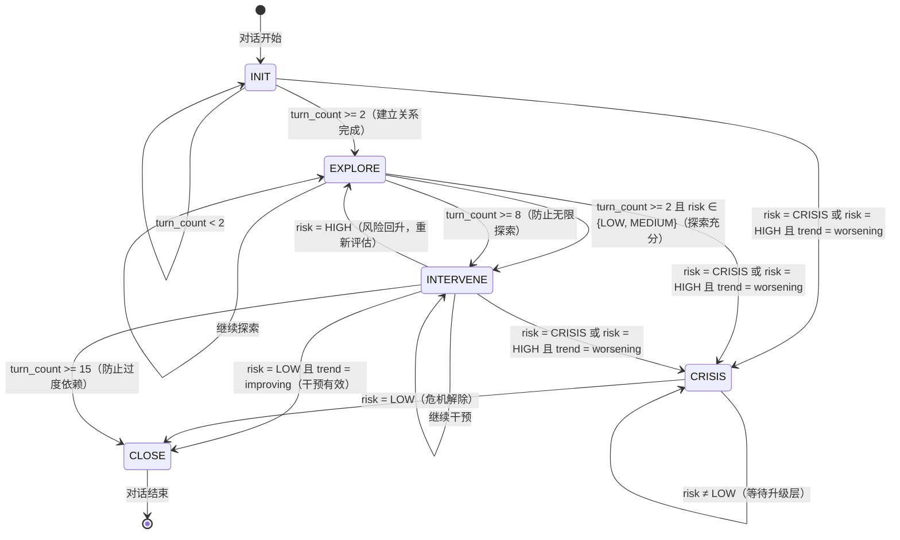

# 对话状态机 —— 状态转移图

## 五状态有限自动机

## 状态说明

| 状态 | 说明 | 允许的动作 |
|------|------|-----------|
| **INIT** | 初始状态：建立关系、说明保密协议 | OPEN_QUESTION, EMOTION_REFLECTION |
| **EXPLORE** | 探索阶段：开放式提问、情绪反映 | OPEN_QUESTION, EMOTION_REFLECTION |
| **INTERVENE** | 干预阶段：CBT 引导、正念引导 | CBT_GUIDE, MINDFULNESS_GUIDE, EMOTION_REFLECTION, RESOURCE_PROVIDE |
| **CRISIS** | 危机状态：安全确认、触发升级层 | SAFETY_CHECK, RESOURCE_PROVIDE |
| **CLOSE** | 结束阶段：总结、资源推荐 | SUMMARY, RESOURCE_PROVIDE |

## 安全约束

1. **CRISIS 状态必须触发升级层接口** —— `requires_escalation=True`
2. **任何状态禁止生成诊断性语言** —— `forbidden_patterns` 包含"诊断/患有/确诊"等
3. **所有转移规则不依赖 LLM** —— 纯逻辑实现

## 设计理由

- **INIT → EXPLORE（≥2轮）**：建立关系需要时间，但不宜过长
- **EXPLORE → INTERVENE（≥2轮）**：确保信息充分后再干预
- **INTERVENE → CLOSE（risk=LOW + improving）**：干预有效才能结束
- **任何 → CRISIS（risk=CRISIS 或 HIGH+worsening）**：危机安全优先
- **INTERVENE → EXPLORE（risk=HIGH）**：风险回升需重新评估
- **EXPLORE → INTERVENE（≥8轮）**：防止无限探索
- **INTERVENE → CLOSE（≥15轮）**：防止过度依赖 AI
