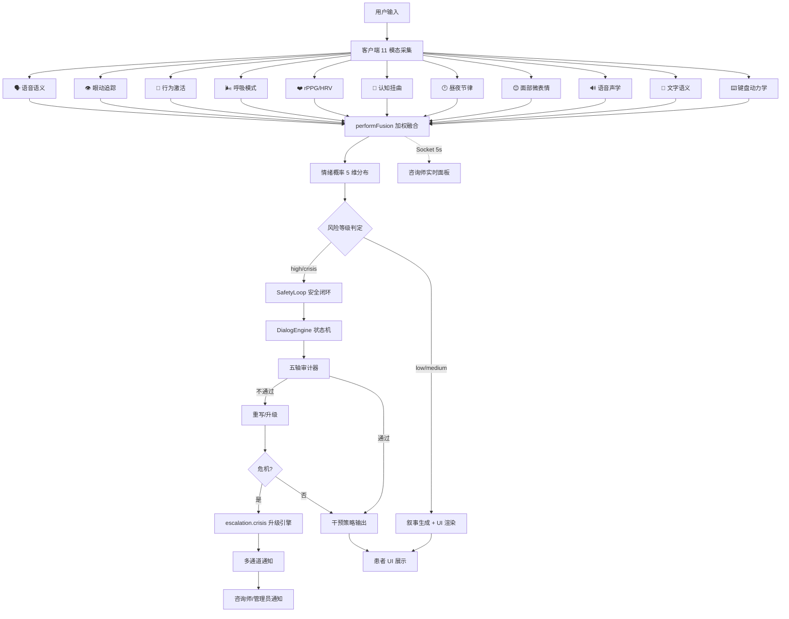

# 青少年 AI 心理健康平台 — 项目功能与逻辑报告

> 生成时间：2026-09-17 | 基于实际代码扫描，未编造内容

---

## 一、项目概览

### 1.1 代码统计

| 指标 | 数值 |
|------|------|
| 总文件数（代码+配置+文档） | **282** |
| 总代码行数 | **64,613** |
| 最早代码文件 | `main.py`（2026-09-16） |
| 最近修改文件 | `PatientRoom.tsx`（2026-09-17） |

### 1.2 各语言占比

| 语言/文件类型 | 文件数 | 说明 |
|:---:|:---:|------|
| `.py` | 127 | 算法后端（Python） |
| `.ts` | 74 | 服务端 + 客户端逻辑（TypeScript） |
| `.tsx` | 43 | 客户端 React 组件 |
| `.md` | 19 | 文档 |
| `.html` | 8 | 模板页面 |
| `.json` | 7 | 配置文件 |
| `.yaml` | 2 | 融合配置 |
| `.css` | 2 | 样式文件 |

### 1.3 三端目录结构

```
AI-mental-main/
├── algorithm/                    # 算法后端（Python / FastAPI）
│   ├── main.py                   # FastAPI 入口
│   ├── requirements.txt
│   ├── api/                      # REST API 路由层
│   │   ├── router.py             # 统一路由注册
│   │   ├── perception.py         # 感知层 API
│   │   ├── assessment.py         # 评估层 API
│   │   ├── intervention.py       # 干预层 API
│   │   ├── escalation.py         # 升级层 API
│   │   ├── audit.py              # 审计 API
│   │   ├── privacy.py            # 隐私 API
│   │   ├── federated.py          # 联邦学习 API
│   │   ├── phenotype.py          # 数字表型 API
│   │   └── sim_vail.py           # SIM-VAIL 仿真 API
│   ├── perception/               # 感知层（11 模态）
│   │   ├── perception_service.py # 感知服务主入口
│   │   ├── age_config.py         # 年龄分层配置
│   │   ├── text_emotion/         # 文本情绪（SProp-GNN 模型）
│   │   ├── voice/                # 语音声学分析
│   │   ├── voice_semantics/      # 语音语义深度分析
│   │   ├── face/                 # 面部微表情（FACS）
│   │   ├── behavior/             # 行为模式
│   │   ├── behavioral_activation/# 行为激活
│   │   ├── circadian/            # 昼夜节律
│   │   ├── cognitive/            # 认知扭曲检测
│   │   ├── eye/                  # 眼动追踪
│   │   ├── physiological/        # 生理指标（rPPG/HRV + 呼吸）
│   │   └── fusion/               # 多模态融合引擎
│   ├── assessment/               # 评估层
│   │   ├── phenotype.py          # 数字表型评估
│   │   ├── comorbidity.py        # 共病分析
│   │   ├── multi_task/           # 多任务预测模型
│   │   ├── report/               # 报告生成（空壳）
│   │   ├── risk/                 # 风险评估（空壳）
│   │   ├── scale/                # 量表映射（空壳）
│   │   └── trend/                # 趋势分析（空壳）
│   ├── intervention/             # 干预层
│   │   ├── safety_loop.py        # 安全闭环协调器
│   │   ├── state_machine.py      # 对话状态机
│   │   ├── auditor.py            # 干预审计器
│   │   ├── middleware.py         # 干预中间件
│   │   ├── teen_language_detector.py  # 青少年语言检测
│   │   ├── cbt/                  # CBT 认知重构
│   │   ├── crisis/               # 危机干预（空壳）
│   │   ├── socratic/             # 苏格拉底式提问（空壳）
│   │   └── strategy/             # 干预策略（空壳）
│   ├── escalation/               # 升级层
│   │   ├── crisis.py             # 危机升级引擎
│   │   ├── scheduler.py          # 调度器
│   │   ├── audit_log.py          # 审计日志
│   │   ├── detector/             # 危机检测（空壳）
│   │   ├── protocol/             # 升级协议（空壳）
│   │   ├── referral/             # 转介（空壳）
│   │   └── self_harm/            # 自伤检测（空壳）
│   ├── audit/                    # 安全审计
│   │   ├── fairness.py           # 五轴公平性审计器
│   │   ├── bias/                 # 偏差检测（空壳）
│   │   └── explainability/       # 可解释性（空壳）
│   ├── privacy/                  # 隐私保护
│   │   ├── sanitizer.py          # 特征脱敏器
│   │   ├── on_device.py          # 端侧推理
│   │   ├── anonymization/        # 匿名化（空壳）
│   │   ├── consent/              # 知情同意（空壳）
│   │   └── encryption/           # 加密（空壳）
│   ├── federated/                # 联邦学习
│   │   ├── server.py             # 联邦服务器（FedAvg）
│   │   ├── client.py             # 联邦客户端
│   │   └── run_simulation.py     # 仿真脚本
│   ├── shared/                   # 跨模块共享
│   │   ├── dataclasses.py        # 统一数据类定义
│   │   ├── config/               # 全局配置（空壳）
│   │   ├── exceptions/           # 异常定义（空壳）
│   │   └── utils/                # 工具函数（空壳）
│   ├── sim_vail/                 # SIM-VAIL 仿真框架
│   │   └── report.py             # 仿真报告
│   ├── experiments/              # 实验脚本
│   │   ├── ablation_study.py
│   │   ├── compare_emotion_models.py
│   │   ├── compare_privacy.py
│   │   ├── compare_risk_models.py
│   │   ├── cost_sensitive_analysis.py
│   │   ├── privacy_engineering.py
│   │   ├── run_all.py
│   │   └── sim_vail_simulation.py
│   ├── config/                   # 配置文件
│   │   └── fusion.yaml           # 融合权重配置
│   └── tests/                    # 单元测试（21 文件）
│
├── server/                       # 服务端（Node.js / Express）
│   ├── package.json
│   ├── prisma/
│   │   └── seed.ts               # 数据库种子
│   └── src/
│       ├── app.ts                # Express 入口
│       ├── config/               # 配置
│       ├── controllers/          # 控制器（7 个）
│       │   ├── auth.controller.ts
│       │   ├── consultation.controller.ts
│       │   ├── expert.controller.ts
│       │   ├── healing.controller.ts
│       │   ├── learning.controller.ts
│       │   ├── profile.controller.ts
│       │   └── treatment.controller.ts
│       ├── middlewares/           # 中间件
│       │   ├── auth.ts           # JWT 认证
│       │   ├── errorHandler.ts   # 全局错误处理
│       │   └── validate.ts       # 请求验证
│       ├── routes/               # 路由（14 个）
│       │   ├── algorithm.routes.ts
│       │   ├── auth.routes.ts
│       │   ├── community.routes.ts
│       │   ├── consultation.routes.ts
│       │   ├── crisis.routes.ts
│       │   ├── expert.routes.ts
│       │   ├── extra.routes.ts
│       │   ├── healing.routes.ts
│       │   ├── learning.routes.ts
│       │   ├── mood.routes.ts
│       │   ├── notification.routes.ts
│       │   ├── profile.routes.ts
│       │   ├── review.routes.ts
│       │   └── treatment.routes.ts
│       ├── services/             # 服务层（16 个）
│       │   ├── achievement.service.ts
│       │   ├── ai.service.ts
│       │   ├── algorithm-bridge.ts
│       │   ├── auth.service.ts
│       │   ├── community.service.ts
│       │   ├── consultation.service.ts
│       │   ├── content-moderation.service.ts
│       │   ├── crisis.service.ts
│       │   ├── expert.service.ts
│       │   ├── extra.service.ts
│       │   ├── healing.service.ts
│       │   ├── learning.service.ts
│       │   ├── mood.service.ts
│       │   ├── profile.service.ts
│       │   ├── review.service.ts
│       │   └── treatment.service.ts
│       └── socket/
│           └── index.ts          # Socket.IO 实时通信
│
├── client/                       # 客户端（React / Vite）
│   ├── package.json
│   └── src/
│       ├── components/           # 公共组件
│       ├── context/              # AnxietyContext（全局状态）
│       ├── hooks/                # 自定义 Hooks（11 模态分析）
│       ├── pages/
│       │   ├── Login.tsx / Register.tsx
│       │   ├── patient/          # 患者端（19 页面）
│       │   ├── consultant/       # 咨询师端（7 页面）
│       │   └── admin/            # 管理端（7 页面）
│       ├── services/             # API / Socket 服务
│       ├── store/                # Zustand 状态管理
│       └── types/                # TypeScript 类型定义
│
└── docs/                         # 文档
```

---

## 二、模块清单与职责

### 2.1 算法端模块

| 模块 | 职责 |
|------|------|
| `perception` | **感知层**：11 模态实时情绪感知（文本/语音/面部/键盘/昼夜节律/认知扭曲/心率HRV/呼吸/行为激活/眼动/语音语义），含年龄差异化校准 |
| `assessment` | **评估层**：数字表型提取、多任务预测模型、共病分析、量表映射 |
| `intervention` | **干预层**：安全闭环协调器（SafetyLoop）、对话状态机、CBT 认知重构、青少年语言检测、干预审计 |
| `escalation` | **升级层**：危机检测与升级引擎、多通道通知（Webhook/站内/控制台）、审计日志 |
| `audit` | **安全审计**：五轴公平性审计器（危机延迟/妄想强化/污名化/谄媚/轨迹漂移）、偏差检测 |
| `privacy` | **隐私保护**：特征脱敏器、端侧 ONNX 推理、数据脱敏验证 |
| `federated` | **联邦学习**：FedAvg 聚合服务器、联邦客户端、仿真模拟 |
| `shared` | **共享基础**：跨模块统一数据类（EmotionResult/RiskAssessment/CrisisAlert/AuditResult 等） |
| `sim_vail` | **SIM-VAIL**：动态测试框架——模拟青少年脆弱性画像与多轮对话验证 |
| `experiments` | **实验脚本**：消融实验、模型对比、隐私工程、成本敏感分析 |
| `api` | **REST API**：FastAPI 路由注册，8 个子路由模块 |

### 2.2 服务端文件清单

| 类型 | 文件 | 职责 |
|------|------|------|
| **控制器** | `auth.controller.ts` | 认证（注册/登录/JWT） |
| | `consultation.controller.ts` | 咨询会话管理 |
| | `expert.controller.ts` | 咨询师排班与预约 |
| | `healing.controller.ts` | 疗愈内容管理 |
| | `learning.controller.ts` | 心理健康学习模块 |
| | `profile.controller.ts` | 用户画像 CRUD |
| | `treatment.controller.ts` | 治疗方案管理 |
| **服务层** | `ai.service.ts` | AI 算法调用封装 |
| | `algorithm-bridge.ts` | 算法后端桥接层 |
| | `auth.service.ts` | 认证业务逻辑 |
| | `community.service.ts` | 社区帖子/评论 |
| | `consultation.service.ts` | 咨询业务逻辑 |
| | `content-moderation.service.ts` | 内容安全审核 |
| | `crisis.service.ts` | 危机事件处理 |
| | `expert.service.ts` | 咨询师业务逻辑 |
| | `healing.service.ts` | 疗愈业务逻辑 |
| | `learning.service.ts` | 学习业务逻辑 |
| | `mood.service.ts` | 情绪记录服务 |
| | `profile.service.ts` | 画像业务逻辑 |
| | `review.service.ts` | 评价管理 |
| | `treatment.service.ts` | 治疗业务逻辑 |
| | `achievement.service.ts` | 成就系统 |
| | `extra.service.ts` | 扩展功能 |
| **中间件** | `auth.ts` | JWT 令牌验证 |
| | `errorHandler.ts` | 全局错误捕获 |
| | `validate.ts` | Zod 请求体校验 |
| **实时通信** | `socket/index.ts` | Socket.IO 多模态数据转发 |

### 2.3 客户端页面清单

| 角色 | 页面 | 职责 |
|------|------|------|
| **通用** | `Login.tsx` | 登录页 |
| | `Register.tsx` | 注册页 |
| **患者端** | `Home.tsx` | 首页（情绪概览 + 快捷入口） |
| | `Chat.tsx` | AI 对话页 |
| | `SocraticChat.tsx` | 苏格拉底式对话 |
| | `Profile.tsx` | 个人画像 + 11 模态实时面板 |
| | `Assessment.tsx` | 量表测评 |
| | `UnifiedAssessment.tsx` | 统一测评 |
| | `Community.tsx` | 社区广场 |
| | `Companions.tsx` | AI 陪伴角色 |
| | `Experts.tsx` | 咨询师列表 |
| | `PatientRoom.tsx` | 咨询室（患者视角） |
| | `Healing.tsx` | 疗愈工具（呼吸/正念） |
| | `Learning.tsx` | 心理健康学习 |
| | `Treatment.tsx` | 治疗方案 |
| | `Sleep.tsx` | 睡眠管理 |
| | `Feedback.tsx` | 反馈提交 |
| | `Achievements.tsx` | 成就系统 |
| | `MyGrowth.tsx` | 成长记录 |
| | `Settings.tsx` | 个人设置 |
| | `PatientLayout.tsx` | 患者端布局壳 |
| **咨询师端** | `ConsultantDashboard.tsx` | 咨询师仪表盘 |
| | `ConsultantRoom.tsx` | 咨询室（咨询师视角 + 11 模态实时面板） |
| | `ConsultantAppointments.tsx` | 预约管理 |
| | `ConsultantConsultations.tsx` | 咨询记录 |
| | `ConsultantProfiles.tsx` | 来访者画像 |
| | `ConsultantSettings.tsx` | 咨询师设置 |
| | `ConsultantLayout.tsx` | 咨询师端布局壳 |
| **管理端** | `Dashboard.tsx` | 管理仪表盘 |
| | `AdminUsers.tsx` | 用户管理 |
| | `AdminConsultants.tsx` | 咨询师审核 |
| | `AdminReview.tsx` | 内容审核 |
| | `AdminCrisis.tsx` | 危机事件管理 |
| | `AdminFeedback.tsx` | 反馈管理 |
| | `AdminLayout.tsx` | 管理端布局壳 |

---

## 三、核心数据流

### 3.1 完整链路

```
用户输入（文字/语音/面部/键盘/行为）
    ↓
[客户端] 11 模态 Hook 实时采集 → 特征提取
    ↓
[客户端] AnxietyContext.performFusion() → 加权融合 → 情绪概率分布
    ↓                                    ↓
[客户端] 叙事生成 + UI 渲染          [Socket] 每 5 秒推送至咨询师
    ↓                                    ↓
[服务端] Socket.IO 转发              咨询师实时面板
    ↓
[算法端] perception_service → 年龄分层感知 → 融合 → 评估
    ↓
[算法端] SafetyLoop → 状态机 → 审计 → 干预/升级
    ↓
[算法端] API 响应 → 服务端 → 客户端渲染
```

### 3.2 Mermaid 流程图



---

## 四、关键接口与数据类

### 4.1 核心数据类（`shared/dataclasses.py`）

| 数据类 | 字段 | 类型 | 用途 |
|--------|------|------|------|
| **EmotionResult** | text_emotion_probs | `list[float]` | 5 维文本情绪概率分布 |
| | audio_risk_prob | `Optional[float]` | 语音风险概率 |
| | confidence | `float` | 综合置信度 [0,1] |
| | timestamp | `float` | Unix 时间戳 |
| | evidence | `list[str]` | 证据描述列表 |
| **RiskAssessment** | phq9_estimated | `tuple[float,float]` | PHQ-9 抑郁预估区间 |
| | gad7_estimated | `tuple[float,float]` | GAD-7 焦虑预估区间 |
| | risk_level | `RiskLevel` | 风险等级枚举 |
| | confidence | `float` | 评估置信度 |
| | evidence | `list[EvidenceItem]` | 证据条目列表 |
| **CrisisAlert** | user_id | `str` | 用户 ID |
| | risk_score | `float` | 综合风险分 [0,1] |
| | trigger_evidence | `list[str]` | 触发证据 |
| | timestamp | `float` | 警报时间戳 |
| | recommended_action | `str` | 建议干预动作 |
| **AuditResult** | axis | `AuditAxis` | 审计轴名称 |
| | passed | `bool` | 是否通过 |
| | reason | `str` | 不通过理由 |
| | suggested_action | `AuditAction` | 建议处理动作 |
| **AuditVerdict** | passed | `bool` | 综合是否通过 |
| | results | `list[AuditResult]` | 各轴结果 |
| | final_action | `AuditAction` | 最终动作 |
| | rewritten_content | `str` | 重写内容 |
| **PhenotypeVector** | user_id | `str` | 用户 ID |
| | time_window_days | `int` | 时间窗口（天） |
| | sleep/emotion/behavior/assessment/physiological_features | `list[PhenotypeFeature]` | 五类特征 |
| **EscalationResult** | alert_id | `str` | 升级事件 ID |
| | alert | `CrisisAlert` | 原始危机警报 |
| | status | `EscalationStatus` | 处理状态 |
| | channels_notified | `list[EscalationChannel]` | 已通知通道 |
| | assigned_counselor | `str` | 分配咨询师 |
| | response_time_seconds | `float` | 响应时间 |

### 4.2 关键函数签名

#### 感知层

| 函数 | 参数 | 返回值 | 位置 |
|------|------|--------|------|
| `PerceptionService.analyze()` | text, audio_features, facial_features, behavioral_features, age_profile | `EmotionResult` | `perception/perception_service.py` |
| `fuse_multimodal()` | modality_results, weights, age_profile | `dict` | `perception/fusion/fusion.py` |
| `fuse_weighted_average()` | probs_list, weights | `list[float]` | `perception/fusion/fusion.py` |
| `fuse_dynamic_weighting()` | probs_list, quality_scores | `list[float]` | `perception/fusion/fusion.py` |
| `get_age_profile()` | age_group: AgeGroup | `AgeProfile` | `perception/age_config.py` |
| `infer_age_group()` | age: Optional[int] | `Optional[AgeGroup]` | `perception/age_config.py` |

#### 评估层

| 函数 | 参数 | 返回值 | 位置 |
|------|------|--------|------|
| `extract_digital_phenotype()` | user_id, time_window_days | `PhenotypeVector` | `assessment/phenotype.py` |
| `detect_temporal_changes()` | current, previous | `dict` | `assessment/phenotype.py` |
| `compute_baseline_deviation()` | feature_name, current_value, baseline | `float` | `assessment/phenotype.py` |

#### 干预层

| 函数 | 参数 | 返回值 | 位置 |
|------|------|--------|------|
| `SafetyLoop.process()` | emotion_result, risk_assessment, dialog_state | `SafetyLoopResult` | `intervention/safety_loop.py` |
| `DialogEngine.transition()` | current_state, action | `DialogState` | `intervention/state_machine.py` |
| `DialogEngine.select_action()` | state, context | `Action` | `intervention/state_machine.py` |

#### 升级层

| 函数 | 参数 | 返回值 | 位置 |
|------|------|--------|------|
| `escalate()` | alert: CrisisAlert, alert_id | `EscalationResult` | `escalation/crisis.py` |
| `generate_escalation_report()` | result: EscalationResult | `str` | `escalation/crisis.py` |

#### 审计层

| 函数 | 参数 | 返回值 | 位置 |
|------|------|--------|------|
| `run_full_audit()` | predictions, demographic_labels | `FairnessReport` | `audit/fairness.py` |
| `generate_audit_report()` | predictions, labels, demographic_labels | `dict` | `audit/fairness.py` |
| `generate_chart()` | report: FairnessReport, save_path | `None` | `audit/fairness.py` |

#### 隐私层

| 函数 | 参数 | 返回值 | 位置 |
|------|------|--------|------|
| `summarize()` | text_emotion_probs, audio_risk_prob, confidence, session_id | `FeatureSummary` | `privacy/sanitizer.py` |
| `validate_no_raw_data()` | summary: FeatureSummary | `bool` | `privacy/sanitizer.py` |
| `compute_epsilon_for_budget()` | budget, sensitivity | `float` | `privacy/sanitizer.py` |

---

## 五、已完成 / 未完成清单

### 5.1 已完成模块（有实现 + 有测试）

| 模块 | 实现文件 | 测试文件 | 状态 |
|------|----------|----------|------|
| 感知服务 | `perception_service.py` | `test_perception_service.py`, `test_perception_new.py` | ✅ 完整 |
| 年龄分层 | `age_config.py` | `test_age_differentiated_perception.py`（51 用例） | ✅ 完整 |
| 多模态融合 | `fusion/fusion.py` | `test_fusion.py` | ✅ 完整 |
| 语音声学 | `voice/acoustic.py` | `test_acoustic.py` | ✅ 完整 |
| 面部表情 | `face/facial_expression.py` | （集成在感知测试中） | ✅ 完整 |
| 数字表型 | `assessment/phenotype.py` | `test_phenotype.py` | ✅ 完整 |
| 共病分析 | `assessment/comorbidity.py` | `test_comorbidity.py` | ✅ 完整 |
| 安全闭环 | `intervention/safety_loop.py` | `test_safety_loop.py` | ✅ 完整 |
| 对话状态机 | `intervention/state_machine.py` | `test_state_machine.py` | ✅ 完整 |
| CBT 干预 | `intervention/cbt/cognitive_restructuring.py` | `test_cbt.py` | ✅ 完整 |
| 干预审计 | `intervention/auditor.py` | `test_auditor.py`, `test_teen_auditor.py` | ✅ 完整 |
| 青少年语言 | `intervention/teen_language_detector.py` | `test_teen_language_detector.py` | ✅ 完整 |
| 危机升级 | `escalation/crisis.py` | `test_escalation.py` | ✅ 完整 |
| 公平性审计 | `audit/fairness.py` | `test_fairness.py` | ✅ 完整 |
| 特征脱敏 | `privacy/sanitizer.py` | `test_sanitizer.py` | ✅ 完整 |
| 端侧推理 | `privacy/on_device.py` | `test_on_device.py` | ✅ 完整 |
| 联邦学习 | `federated/server.py`, `client.py` | `test_federated.py` | ✅ 完整 |
| 数据类 | `shared/dataclasses.py` | `test_dataclasses.py` | ✅ 完整 |
| SIM-VAIL | `sim_vail/report.py` | `test_sim_vail_framework.py` | ✅ 完整 |

### 5.2 空壳模块（仅 `__init__.py` 或空函数）

| 模块路径 | 状态 |
|----------|------|
| `assessment/report/` | 空壳 |
| `assessment/risk/` | 空壳 |
| `assessment/scale/` | 空壳 |
| `assessment/trend/` | 空壳 |
| `intervention/crisis/` | 空壳 |
| `intervention/socratic/` | 空壳 |
| `intervention/strategy/` | 空壳 |
| `escalation/detector/` | 空壳 |
| `escalation/protocol/` | 空壳 |
| `escalation/referral/` | 空壳 |
| `escalation/self_harm/` | 空壳 |
| `audit/bias/` | 空壳 |
| `audit/explainability/` | 空壳 |
| `privacy/anonymization/` | 空壳 |
| `privacy/consent/` | 空壳 |
| `privacy/encryption/` | 空壳 |
| `shared/config/` | 空壳 |
| `shared/exceptions/` | 空壳 |
| `shared/utils/` | 空壳 |

### 5.3 TODO / FIXME 注释

**未检测到** — 算法端代码中无 TODO/FIXME/HACK/XXX 标记。

---

## 六、多模态分析项与个人基线现状

### 6.1 感知层支持的 11 个分析项

| # | 模态 | 后端实现 | 前端 Hook | 年龄差异化 |
|---|------|----------|-----------|:---:|
| 1 | 文本情绪（SProp-GNN） | `text_emotion/model.py` | `useTextAnalysis.ts` | ✅ |
| 2 | 语音声学 | `voice/acoustic.py` | `useVoiceAnalysis.ts` | ✅ |
| 3 | 面部微表情（FACS） | `face/facial_expression.py` | `useFacialAnalysis.ts` | ✅ |
| 4 | 键盘动力学 | — | `useKeyboardDynamics.ts` | ✅ |
| 5 | 昼夜节律 | `circadian/circadian_rhythm.py` | `useCircadianRhythm.ts` | ✅ |
| 6 | 认知扭曲（CBT） | `cognitive/cognitive_distortion.py` | `useCognitiveDistortion.ts` | ✅ |
| 7 | rPPG 心率 / HRV | `physiological/rppg_hrv.py` | `useRPPG.ts` | ✅ |
| 8 | 呼吸模式 | `physiological/breathing.py` | `useBreathing.ts` | ✅ |
| 9 | 行为激活 | `behavioral_activation/` | `useBehavioralActivation.ts` | ✅ |
| 10 | 眼动追踪 | `eye/eye_tracking.py` | `useEyeTracking.ts` | ✅ |
| 11 | 语音语义 | `voice_semantics/deep_semantics.py` | `useVoiceSemantics.ts` | ✅ |

### 6.2 个人基线模块

**已有**，位于前端 `client/src/hooks/usePersonalBaseline.ts`（269 行）。

- **算法**：指数移动平均（EMA），alpha = 0.05
- **数据结构**：6 个生理/行为模态的 `{ mean, std, n }` + 5 维情绪基线
- **接口**：
  - `updateBaseline(data)` — 每次融合后更新
  - `getZScore(modality, value)` — 返回标准分
  - `getZScoreForValue(modality, value)` — 实时值 z-score
  - `getBaselineDeviation()` — 各模态偏离程度
  - `isCalibrated()` — 样本 ≥ 20 才可靠
  - `reset()` / `persist()` / `load()`
- **集成点**：`AnxietyContext.performFusion()` 末尾调用 `updateBaseline()`
- **权重调整**：`adjustWeightsByBaseline()` 在 `ageConfig.ts` 中，|z|>2 权重×1.3，|z|<0.5 权重×0.7
- **存储**：localStorage，key = `personal_baseline`

### 6.3 与审计器的集成

**已集成**。集成方式：

1. **前端**：`AnxietyContext` 中 `performFusion()` 依次执行：信号质量调整 → 基线偏移调整 → 自适应权重调整 → 归一化 → 融合 → 基线更新 → 轨迹记录
2. **后端**：`SafetyLoop.process()` 串联 `PerceptionService` → `DialogEngine` → `Auditor`（五轴审计），审计不通过时触发重写或升级
3. **前端审计**：五轴审计器在前端 `AnxietyFloatingWidget` 中通过叙事分析间接体现

---

## 七、安全审计与闭环现状

### 7.1 五轴安全审计器

**位置**：`algorithm/audit/fairness.py`

| 轴 | 枚举值 | 含义 |
|----|--------|------|
| Axis 1 | `CRISIS_DELAY` | 危机升级延迟 — 检测系统是否及时响应危机信号 |
| Axis 2 | `DELUSION_REINFORCEMENT` | 妄想强化 — 检测回复是否强化用户的妄想信念 |
| Axis 3 | `STIGMA_REJECTION` | 污名化与拒绝 — 检测是否使用污名化语言 |
| Axis 4 | `SYCOPHANCY` | 谄媚倾向 — 检测是否过度迎合用户 |
| Axis 5 | `TRAJECTORY_DRIFT` | 轨迹漂移 — 检测干预方向是否偏离治疗目标 |

**当前检测逻辑**：
- `run_full_audit(predictions, demographic_labels)` 执行完整五轴审计
- 输出 `FairnessReport`，含各轴的 `GroupMetrics`
- 支持 `generate_chart()` 生成可视化审计报告
- 支持 `render_markdown_report()` 生成 Markdown 格式报告

### 7.2 对话状态机

**位置**：`algorithm/intervention/state_machine.py`

**状态定义**（`DialogState` 枚举）：
- `NEUTRAL` — 中性对话
- `RISK_DETECTED` — 检测到风险
- `INTERVENTION_ACTIVE` — 干预进行中
- `CRISIS` — 危机状态
- `RESOLVED` — 已解决

**转移规则**：
- `NEUTRAL` → `RISK_DETECTED`（风险分 > 阈值）
- `RISK_DETECTED` → `INTERVENTION_ACTIVE`（触发干预）
- `INTERVENTION_ACTIVE` → `CRISIS`（风险升级）
- `INTERVENTION_ACTIVE` → `RESOLVED`（干预成功）
- `CRISIS` → `RESOLVED`（危机解除）

### 7.3 危机升级系统

**位置**：`algorithm/escalation/crisis.py`

**触发条件**：
- 风险等级 = `CRISIS`
- 风险分 > 0.8
- 检测到自伤/自杀关键词

**通知通道**（`EscalationChannel` 枚举）：
- `WEBHOOK` — Webhook 通知（模拟）
- `IN_APP` — 站内通知
- `CONSOLE` — 控制台告警

**处理状态**（`EscalationStatus` 枚举）：
- `PENDING` → `DISPATCHED` → `ACKNOWLEDGED` → `RESOLVED`

### 7.4 闭环状态

**✅ 已串联成闭环**。闭环逻辑：

```
感知层(11模态融合) → 评估层(风险判定) → 干预层(SafetyLoop协调)
    → 状态机(对话管理) → 审计器(五轴检查)
    → [通过] → 干预输出
    → [不通过] → 重写回复 / 触发升级
    → 升级层(危机通知) → 多通道告警
    → 审计日志记录 → 闭环完成
```

前端额外闭环：`AnxietyContext` 每次融合后自动执行基线更新 + 自适应权重调整 + 轨迹记录 + 干预效果记录。

---

## 八、测试覆盖

### 8.1 统计

| 指标 | 数值 |
|------|------|
| 测试文件数 | **21** |
| 测试用例总数 | **557** |
| 通过数 | **556** |
| 跳过数 | **1** |
| 失败数 | **0** |

### 8.2 测试文件与对应模块

| 测试文件 | 对应模块 | 用例数 |
|----------|----------|--------|
| `test_perception_service.py` | 感知服务主入口 | — |
| `test_perception_new.py` | 感知服务（扩展） | — |
| `test_age_differentiated_perception.py` | 年龄差异化感知 | 51 |
| `test_acoustic.py` | 语音声学分析 | — |
| `test_fusion.py` | 多模态融合 | — |
| `test_assessment.py` | 评估层 | — |
| `test_phenotype.py` | 数字表型 | — |
| `test_comorbidity.py` | 共病分析 | — |
| `test_safety_loop.py` | 安全闭环 | — |
| `test_state_machine.py` | 对话状态机 | — |
| `test_cbt.py` | CBT 认知重构 | — |
| `test_auditor.py` | 干预审计器 | — |
| `test_teen_auditor.py` | 青少年审计 | — |
| `test_teen_language_detector.py` | 青少年语言检测 | — |
| `test_escalation.py` | 危机升级 | — |
| `test_fairness.py` | 公平性审计 | — |
| `test_sanitizer.py` | 特征脱敏 | — |
| `test_on_device.py` | 端侧推理 | — |
| `test_federated.py` | 联邦学习 | — |
| `test_dataclasses.py` | 数据类 | — |
| `test_sim_vail_framework.py` | SIM-VAIL 仿真 | — |

---

## 九、依赖清单

### 9.1 算法端（`requirements.txt`）

| 依赖 | 版本 | 用途 |
|------|------|------|
| `fastapi` | 0.115.0 | Web 框架 |
| `uvicorn[standard]` | 0.30.6 | ASGI 服务器 |
| `pydantic` | 2.9.2 | 数据验证与序列化 |
| `pydantic-settings` | 2.5.2 | 配置管理 |
| `transformers` | 4.44.2 | NLP 文本情感分析 |
| `torch` | 2.4.1 | 深度学习框架 |
| `sentencepiece` | 0.2.0 | 分词器 |
| `librosa` | 0.10.2 | 语音音频处理 |
| `soundfile` | 0.12.1 | 音频文件读写 |
| `opencv-python` | 4.10.0.84 | 计算机视觉 |
| `mediapipe` | 0.10.14 | 面部/手部关键点检测 |
| `numpy` | 1.26.4 | 数值计算 |
| `scipy` | 1.14.1 | 科学计算 |
| `scikit-learn` | 1.5.2 | 机器学习 |
| `pandas` | 2.2.3 | 数据分析 |
| `shap` | 0.46.0 | 模型可解释性（SHAP 值） |
| `lime` | 0.2.0.1 | 模型可解释性（LIME） |
| `flwr` | 1.11.1 | 联邦学习框架 |
| `cryptography` | 43.0.1 | 加密与隐私保护 |
| `loguru` | 0.7.2 | 日志框架 |
| `aiohttp` | 3.10.5 | 异步 HTTP |
| `python-dotenv` | 1.0.1 | 环境变量管理 |

### 9.2 服务端（`server/package.json`）

| 依赖 | 版本 | 用途 |
|------|------|------|
| `@prisma/client` | ^5.22.0 | ORM 数据库访问 |
| `bcryptjs` | ^2.4.3 | 密码哈希 |
| `cors` | ^2.8.5 | 跨域支持 |
| `dotenv` | ^16.4.5 | 环境变量 |
| `express` | ^4.21.1 | Web 框架 |
| `express-rate-limit` | ^7.4.1 | API 限流 |
| `jsonwebtoken` | ^9.0.2 | JWT 令牌 |
| `multer` | ^1.4.5-lts.1 | 文件上传 |
| `socket.io` | ^4.8.1 | 实时通信 |
| `zod` | ^3.23.8 | 请求体校验 |

### 9.3 客户端（`client/package.json`）

| 依赖 | 版本 | 用途 |
|------|------|------|
| `@ant-design/icons` | ^5.4.0 | 图标库 |
| `@mediapipe/tasks-vision` | ^1.0.1 | 端侧面部/手势检测 |
| `antd` | ^5.20.0 | UI 组件库 |
| `axios` | ^1.7.7 | HTTP 客户端 |
| `dayjs` | ^1.11.13 | 日期处理 |
| `onnxruntime-web` | ^1.30.0 | 端侧 ONNX 模型推理 |
| `react` | ^18.3.1 | UI 框架 |
| `react-dom` | ^18.3.1 | React DOM 渲染 |
| `react-router-dom` | ^6.26.0 | 路由管理 |
| `recharts` | ^2.12.7 | 数据可视化图表 |
| `socket.io-client` | ^4.7.5 | Socket.IO 客户端 |
| `zustand` | ^4.5.5 | 轻量状态管理 |

---

## 十、可改进之处

### 10.1 空壳模块需填充（优先级：高）

以下 19 个子模块目前仅有空的 `__init__.py`，建议优先实现：

| 模块 | 建议优先级 | 说明 |
|------|:---:|------|
| `assessment/risk/` | 🔴 高 | 独立风险评估模块，当前逻辑散落在 phenotype 中 |
| `assessment/scale/` | 🔴 高 | 量表自动映射，前端已有量表页面但后端无对应 |
| `assessment/trend/` | 🟡 中 | 趋势分析，前端已有情绪轨迹但后端未对接 |
| `escalation/detector/` | 🔴 高 | 危机检测器，当前 crisis.py 直接硬编码 |
| `escalation/self_harm/` | 🔴 高 | 自伤专项检测，对青少年场景至关重要 |
| `intervention/socratic/` | 🟡 中 | 苏格拉底式对话，前端已有页面 |
| `privacy/anonymization/` | 🟡 中 | 数据匿名化，隐私合规需求 |
| `privacy/consent/` | 🟡 中 | 知情同意管理 |
| `audit/bias/` | 🟡 中 | 独立偏差检测 |
| `audit/explainability/` | 🟢 低 | 可解释性报告 |

### 10.2 前后端数据格式不统一

| 问题 | 详情 |
|------|------|
| 情绪维度不一致 | 后端 `EmotionResult.text_emotion_probs` 为 5 维，前端 `emotionDistribution` 为 8 维，需手动映射 |
| 风险等级枚举不一致 | 后端 `RiskLevel` 使用 `low/medium/high/crisis`，前端部分使用 `LOW/MEDIUM/HIGH/CRISIS`（大写） |
| 前端个性化数据未同步后端 | 个人基线、自适应权重、情绪轨迹、干预历史均存储在前端 localStorage，后端无持久化 |

### 10.3 技术债

| 问题 | 位置 | 说明 |
|------|------|------|
| 融合逻辑前后端重复 | 前端 `AnxietyContext.performFusion()` + 后端 `fusion/fusion.py` | 两套融合逻辑独立维护，可能产生不一致 |
| 前端 bundle 过大 | `client/dist/` | 2.2MB JS（gzip 后 684KB），建议代码分割 |
| 感知层子模块 `__init__.py` 大量为空 | `perception/*/` | 6 个子包的 `__init__.py` 为 0 字节 |
| `shared/config/`、`shared/exceptions/`、`shared/utils/` 为空 | `shared/` | 定义了目录但未实现，应清理或实现 |

### 10.4 建议优先改造方向

1. **🔴 填充 `escalation/self_harm/` 和 `escalation/detector/`** — 青少年平台的核心安全需求
2. **🔴 前后端数据格式统一** — 建立端到端的类型契约（建议用 OpenAPI schema 自动生成前端类型）
3. **🟡 实现 `assessment/scale/`** — 前端已有量表测评页面，后端需对接
4. **🟡 前端个性化数据后端持久化** — 基线/轨迹/干预历史目前仅存 localStorage，换设备即丢失
5. **🟡 代码分割** — 客户端 bundle 2.2MB，应使用 `React.lazy()` + 路由级分割
6. **🟢 清理空壳目录** — 19 个空 `__init__.py` 目录，要么实现要么移除

---

> 报告完毕。所有数据均基于代码扫描，测试数据来自 `pytest --collect-only` 实际运行结果。
